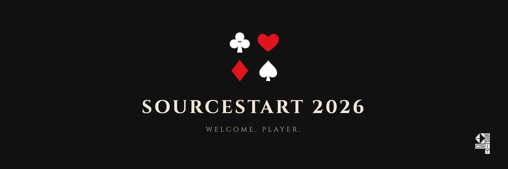

  <h1>SourceStart</h1>
  
<b>IN THE BORDERLAND</b> &nbsp;·&nbsp; CSI SPIT

  
♠ &nbsp; ♥ &nbsp; ♦ &nbsp; ♣

**Welcome, player.** You have entered the Borderland. There are **12 arenas**, and each one is an open-source project. Inside them are games: bugs to fix, features to build, and flaws that nobody has found yet.

Clear games to earn points. The players holding the most points when the timer runs out win.

*Some games are on the board. Some are hidden.*
| Game start | Time limit | Arenas | Explain your PR |
|:---:|:---:|:---:|:---:|
| **1 Oct 2026** | **1 month** | **12** | Within 48 hours |

## The arenas

Every repository is an arena. Enter any of them, as many times as you like. Each README explains how to run it and how it's *supposed* to work. Read it before you play.

| Arena | What it is | Stack |
|---|---|---|
| [campus-landing](https://github.com/techcsispit/campus-landing) | Freshers' guide page | HTML, CSS, JS |
| [code-corner](https://github.com/techcsispit/code-corner) | Small problems, solved in many languages | C, C++, Java, Python, JS, Go |
| [terminal-games](https://github.com/techcsispit/terminal-games) | 2048, tic-tac-toe, hangman | C++ |
| [canteen-connect](https://github.com/techcsispit/canteen-connect) | Canteen ordering app | React, TypeScript |
| [event-board](https://github.com/techcsispit/event-board) | Campus events board | Node.js, Express |
| [snip](https://github.com/techcsispit/snip) | Link shortener with an API | Go |
| [mess-mood](https://github.com/techcsispit/mess-mood) | Review classifier, from scratch | Python (ML) |
| [mini-chain](https://github.com/techcsispit/mini-chain) | A small blockchain | Java |
| [expense-split](https://github.com/techcsispit/expense-split) | Split costs in a group | Python |
| [grade-tracker](https://github.com/techcsispit/grade-tracker) | Marks, grades and GPA | Python |
| [timetable-cli](https://github.com/techcsispit/timetable-cli) | Your timetable in a terminal | Python |
| [weather-journal](https://github.com/techcsispit/weather-journal) | Log and study the weather | Python |

All you need is a GitHub account. Clone an arena and work in your usual editor, or use GitHub Codespaces (**Code → Codespaces → Create**) to run it in your browser.

## How to play

1. **Choose a game.** Browse the open issues in any arena. Pick one that fits your skills, whether that's web, backend, ML or docs.
2. **Claim it.** Comment on the issue saying you're taking it. A Game Master assigns it to you.
3. **Play.** Fork the arena, create a new branch (never work on `main`), and make your change.
4. **Submit.** Open a pull request. *Say what you changed and why*, and link the issue. Ex: `Closes #12`.
5. **Game clear.** When your pull request is merged, the points are yours.

## The cards

| Card | Game | Points |
|---|---|:---:|
| ♣ Clubs | Fix a listed starter issue (labelled `good first issue`) | **1** |
| ♠ Spades | Fix a listed advanced issue (labelled `advanced`) | **3** |
| 🃏 Joker | Find a hidden bug and fix it | **2 / 6** |
| ♦ Diamonds | A good bug report, without a fix | **1** |
| ♥ Hearts | Docs, tests or a new feature: a typo fix is 1, a feature with tests is 3 | **1–3** |

### 🃏 The Joker: hidden games

Not every game is on the board. Some bugs were hidden on purpose. Each README says how its project is supposed to work, and somewhere it doesn't.

1. **Report it.** Open an issue: what you did, what you expected, and what happened instead.
2. **Fix it.** Open a pull request that fixes it and links your issue.
3. **Get your level.** A Game Master confirms the bug and rates it starter (**2 points**) or advanced (**6 points**).

Same bug, two players? Whoever opened their issue **first** takes the points. Check the open issues before you report.

## Clear conditions

A Game Master merges your pull request only if it passes **all four**:

- **Quality.** It works, it's readable, and it doesn't break anything else.
- **Creativity.** A thought-through solution, not just the first thing that happened to work.
- **Impact.** It actually makes the project better.
- **Guidelines.** Your own branch, a clear description, the issue linked, and one change per pull request.

Before a game clears, the Game Master may ask *"How does your change work?"* on your pull request. Answer in your own words within **48 hours**, or you get **half points**. You may use AI, but you must understand every move you make.

## Rules of engagement

- **Claim before you play**, so two players don't do the same work.
- **One issue, one pull request.** Keep each change focused.
- **Review each other.** Reading other players' pull requests is part of open source.
- **Be kind** in issues, pull requests and the channel.
- **The Game Masters' decision is final** on points and merges.

> **Game over.** Copying another player's work, splitting one fix into many pull requests to farm points, spam or empty pull requests, reporting bugs you created yourself, or harassing other players removes **all your points**.

## Stuck?

Ask in the event channel, not in DMs, so every player can see the answer.

   
  <b>GOOD LUCK, PLAYER.</b>
    
  

